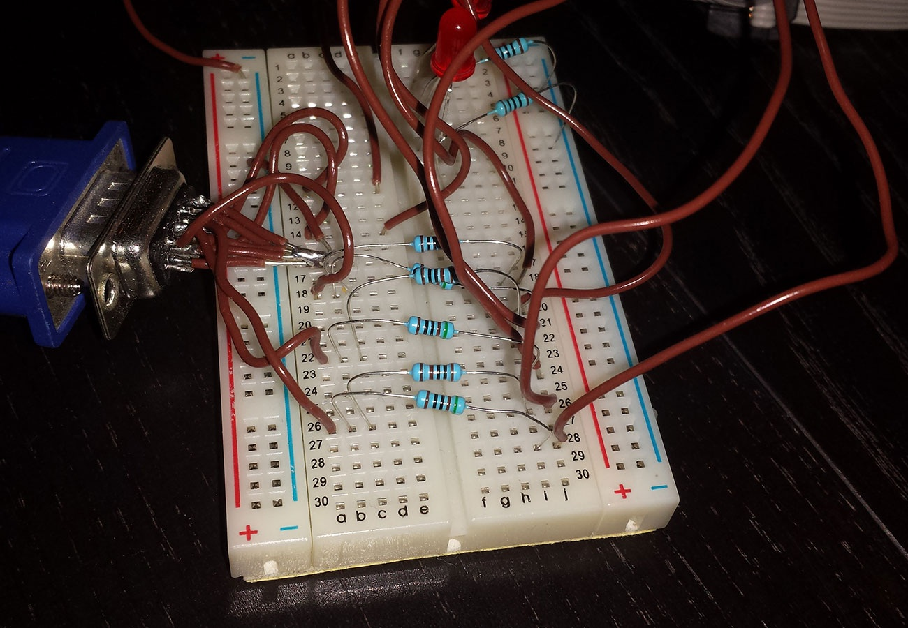
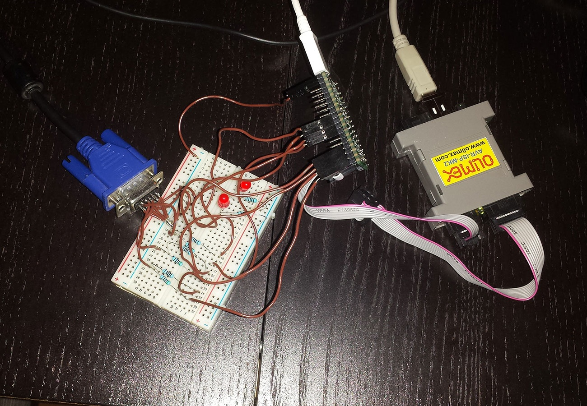

# VGA on 8-bit XMEGA

Bit-banged VGA output on an overclocked 8-bit XMEGA microcontroller using pure C.

## Demo
<video src="https://github.com/user-attachments/assets/378860cd-6f51-48d7-b18b-5c9fdce3b1e1" width="960" height="540"></video>

## Microcontroller
- Atmel XMEGA 128A4U @ 64 MHz (overclocked from 16 MHz)

## Features
- VGA engine (360×480 pixels) using a 60×60 color tile map  
- Hardware-timed HSync/VSYNC signals  
- 6-bit color graphics (pixels and rectangles)  
- Frame-based sprite animation (Super Mario demo)  
- Lightweight and modular for custom sprites/effects  

## Images

## License

MIT © [Lauri Tunnela](https://github.com/tunnela)
